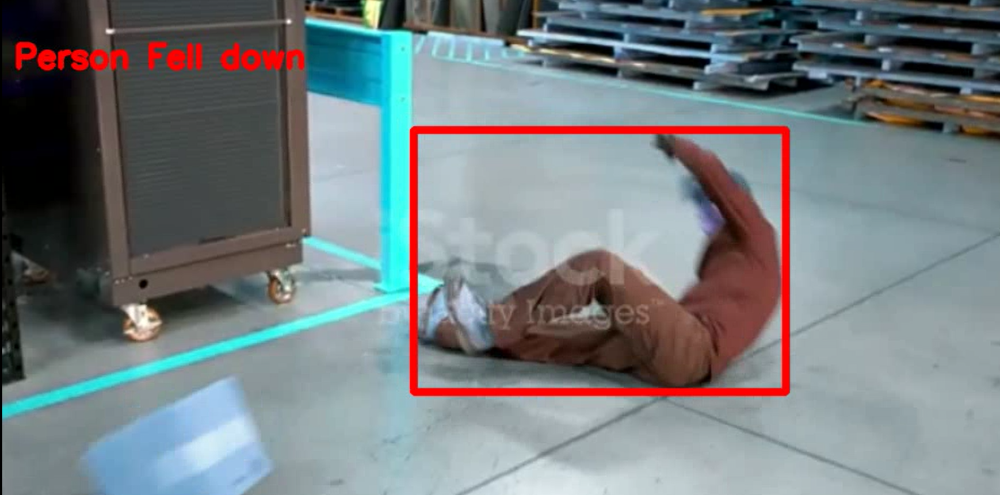

# StaircaseFall-detection

## Overview
This fall detection system is designed to analyze video streams in real-time and identify instances of falls. It integrates pose estimation and object detection techniques to detect human poses and fall-related objects, allowing for accurate fall detection even in complex environments.

## Features
- Integration of pose estimation and object detection models
- Automated detection of fall-related poses and objects
- Visualization of detected falls on video frames
- Easy integration into existing video surveillance systems

## Installation
1. Clone the repository to your local machine:

    ```
    git clone https://github.com/rrsr28/StaircaseFall-detection
    ```

2. Install the required dependencies:

    ```
    pip install -r requirements.txt
    ```

3. Download pre-trained models for pose estimation and object detection:
   - Yolo Model: [Link to Model](https://github.com/WongKinYiu/yolov7/releases/download/v0.1/yolov7-w6-pose.pt)
   
   Place the downloaded models in the appropriate directories within the project folder.

## Usage
1. Run the fall detection system on a video file:

    ```
    python main.py
    ```
   This will generate a output video with fall alarms


2. For stairs specific fall detection:

    ```
    python main2.py
    ```
   Run this only after running main.py first

## Gallery



---